# Questionnaire EBOLA
JcB, SUffler  
21 juin 2015  

Matériel et méthode
===================

__Question de Recherche__: Evaluation de l'anxiété face à la menace Ebola, au sein du personnel des urgences. Etude multicentrique portant sur deux villes universitaires (Reims et Strasbourg).

Au cours des tests statistiques, une différence est considérée comme significative lorsque __p < 0.05__ (5%). Les tests statistiques utilisés:

- Test t de Student pour comparer 2 variables quantitatives
- Analyse de la variance (ANOVA) pour comparer 3 variables quantitatives ou plus
- Le test du Chi2 pour comparer 2 variables qualitatives ou le test exact de Fisher lorsque les effectifs sont faibles.
- Une différence entre deux ou plusieurs groupes est considérée commme significative lorsque p < 0.05 (5%) [c'est à dire qu'il y a moins de 5 chances sur 100 que la différence observée soit due au hasard]
- La cohérence interne du questionnaire est estimée par le coefficient alpha de Cronbach

La mesure de l'anxiété utilise une échelle de likert à 7 items ce qui permet aux répondants de ne pas prendre position sur une question. On obtient ainsi une représentation graphiques des réponses avec 3 zones:

- plutôt contre (couleur dominante brune)
- plutôt pour (couleur dominante verte)
- indécis (couleur grise). La largeur de cette bande de couleur exprime le degré d'embaras que soulève la question dans le groupe (exprimé plus formellement par un pourcentage)

Les représentations graphiques des groupes utilisent la représentation dite en __boite à moustaches__ (boxplot) qui permettent de représenter simultannément plusieurs paramètres et de comparer visuellement les groupes. 


source: wikipedia (version anglaise).

Le questionnaire comprend 2 parties:

- des questions factorielles (Ville, catégorie socio-profesionnelle [CSP]) qui permettent de créer des sous groupes.
- 15 questions sous forme d'items de Lickert (7 niveaux de réponses) constituant une échelle de Likert. Pour chaque item, la réponse 
est une variable ordinale (c'est à dire que le rang est significatif) variant de 1 à 7. Le choix de la réponse possible est un nombre impair ce qui implicetement découpe l'éventail des réponses possibles en trois zones:
    - zone de rejet (1 à 3)
    - zone d'indécision (4)
    - zone d'acceptation (5 à 7)
    
Les questions peuvent être regroupées pour former des scores intermédiaires:

    - niveau d'information (1 et 2)
    - niveau de formation (12.14.15)
    - sentiment provoqué par ebola (3.4.5.13)
    - estime de soi (6.7.8.9.10.11)

Données générales
===================


```
     NUMERO       QUEST.1       QUEST.2       QUEST.3        QUEST.4    
 Min.   :  1   Min.   :1.0   Min.   :1.0   Min.   :1.00   Min.   :1.00  
 1st Qu.: 30   1st Qu.:3.0   1st Qu.:2.0   1st Qu.:4.00   1st Qu.:1.00  
 Median : 59   Median :4.0   Median :3.0   Median :5.00   Median :4.00  
 Mean   : 59   Mean   :3.9   Mean   :3.4   Mean   :4.98   Mean   :3.91  
 3rd Qu.: 88   3rd Qu.:5.0   3rd Qu.:5.0   3rd Qu.:6.00   3rd Qu.:6.00  
 Max.   :117   Max.   :7.0   Max.   :7.0   Max.   :7.00   Max.   :7.00  
    QUEST.5        QUEST.6        QUEST.7        QUEST.8        QUEST.9    
 Min.   :1.00   Min.   :1.00   Min.   :1.00   Min.   :1.00   Min.   :1.00  
 1st Qu.:2.00   1st Qu.:2.00   1st Qu.:4.00   1st Qu.:3.00   1st Qu.:4.00  
 Median :4.00   Median :4.00   Median :5.00   Median :4.00   Median :6.00  
 Mean   :4.11   Mean   :4.11   Mean   :4.74   Mean   :4.31   Mean   :5.23  
 3rd Qu.:6.00   3rd Qu.:6.00   3rd Qu.:6.00   3rd Qu.:5.00   3rd Qu.:6.00  
 Max.   :7.00   Max.   :7.00   Max.   :7.00   Max.   :7.00   Max.   :7.00  
    QUEST.10       QUEST.11       QUEST.12       QUEST.13       QUEST.14   
 Min.   :1.00   Min.   :1.00   Min.   :1.00   Min.   :1.00   Min.   :1.00  
 1st Qu.:3.00   1st Qu.:3.00   1st Qu.:5.00   1st Qu.:2.00   1st Qu.:3.00  
 Median :5.00   Median :5.00   Median :6.00   Median :4.00   Median :5.00  
 Mean   :4.44   Mean   :4.45   Mean   :5.37   Mean   :3.78   Mean   :4.38  
 3rd Qu.:6.00   3rd Qu.:6.00   3rd Qu.:7.00   3rd Qu.:5.00   3rd Qu.:6.00  
 Max.   :7.00   Max.   :7.00   Max.   :7.00   Max.   :7.00   Max.   :7.00  
    QUEST.15    FORME   DUREE    SAMU      CSP       VILLE   
 Min.   :1.00   N:24   NON :24     :24   ADE :27   REIMS:58  
 1st Qu.:3.00   O:93   < 6 :76   O :85   IADE:16   STRAS:59  
 Median :4.00          6-12:10   O+: 8   IDE :41             
 Mean   :4.03          >12 : 7           MED :32             
 3rd Qu.:6.00                            NA's: 1             
 Max.   :7.00                                                
```
Le fichier des données comporte 117 lignes et 21 variables:

```
 [1] "NUMERO"   "QUEST.1"  "QUEST.2"  "QUEST.3"  "QUEST.4"  "QUEST.5" 
 [7] "QUEST.6"  "QUEST.7"  "QUEST.8"  "QUEST.9"  "QUEST.10" "QUEST.11"
[13] "QUEST.12" "QUEST.13" "QUEST.14" "QUEST.15" "FORME"    "DUREE"   
[19] "SAMU"     "CSP"      "VILLE"   
```

Le __coefficient de Cronbach__ pour la partie score de Likert est de __0.68__ ([interprétation du coefficient de Cronbach](http://www.wikiwand.com/en/Cronbach's_alpha)).

Les colonnes 2 à 16 correspondent aux items de Likert et 17 à 21 sont des variables factorielles sauf "DUREE".

Répartition des participants:


```
       
        ADE IADE IDE MED
  REIMS  11    9  26  12
  STRAS  16    7  15  20
```
Il n'y a pas de différence significative dans la composition des deux échantillons (chi2 = 6.13, p = 0.11).


Analyse univariée
=================

Catégorie socio-professionnelle
-------------------------------


```
 ADE IADE  IDE  MED NA's 
  27   16   41   32    1 
```

Ville
-----

```
REIMS STRAS 
   58    59 
```

```
       
        ADE IADE IDE MED
  REIMS  11    9  26  12
  STRAS  16    7  15  20
```

```

	Pearson's Chi-squared test

data:  d$VILLE and d$CSP
X-squared = 6, df = 3, p-value = 0.1
```

Nombre de personnels formés au risque Ebola
--------------------------------------------

```r
t <- table(d$CSP , d$FORME)
t
```

```
##       
##         N  O
##   ADE   2 25
##   IADE  2 14
##   IDE  15 26
##   MED   5 27
```

```r
barplot(t(t), beside = TRUE, main = "Nombre de personnels formés", ylab = "Fréquence")
legend("top", legend = c("Formés", "Non formés"), col = c("gray80", "gray20"), pch = 15, bty = "FALSE")
```

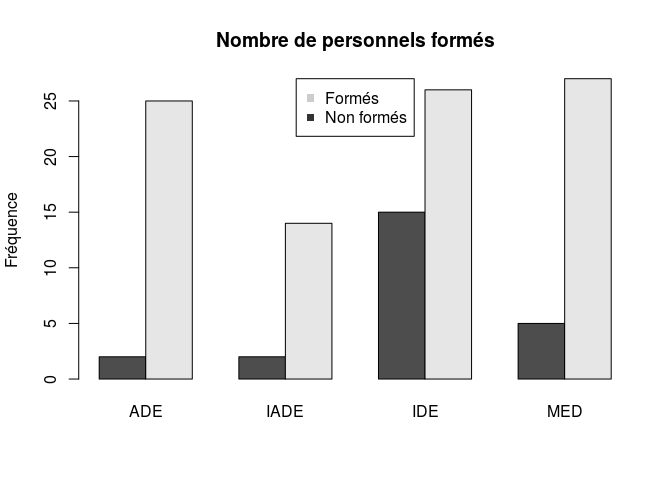 

```r
# chisq.test(t)
f <- fisher.test(t)
f
```

```
## 
## 	Fisher's Exact Test for Count Data
## 
## data:  t
## p-value = 0.02
## alternative hypothesis: two.sided
```

Il y a une différence: le nombre de non formés est plus important dans la catégorie IDE (p = 0.019).

Nombre de personnels formés au risque Ebola selon la ville
--------------------------------------------


```r
t <- table(d$VILLE , d$FORME)
t
```

```
##        
##          N  O
##   REIMS 19 39
##   STRAS  5 54
```

```r
barplot(t(t), beside = TRUE, main = "Nombre de personnels formés", ylab = "Fréquence")

legend("top", legend = c("Formés", "Non formés"), col = c("gray80", "gray20"), pch = 15, bty = "FALSE")
```

 

```r
c <- chisq.test(t)
c
```

```
## 
## 	Pearson's Chi-squared test with Yates' continuity correction
## 
## data:  t
## X-squared = 9, df = 1, p-value = 0.002
```

Il y a plus de personnels formés à Strasbourg (p = 0.002) qu'à Reims.

Durée de la formation
---------------------

```
 NON  < 6 6-12  >12 
  24   76   10    7 
```

```
       
        NON < 6 6-12 >12
  REIMS  19  33    0   6
  STRAS   5  43   10   1
```

```
Warning in chisq.test(d$VILLE, d$DUREE): Chi-squared approximation may be
incorrect
```

```

	Pearson's Chi-squared test

data:  d$VILLE and d$DUREE
X-squared = 20, df = 3, p-value = 4e-05
```

```

	Pearson's Chi-squared test

data:  t3
X-squared = 10, df = 2, p-value = 0.004
```

```
       
        NON < 6 6-12 >12
  REIMS  19  33    0   6
  STRAS   5  43   10   1
```

```

	Fisher's Exact Test for Count Data

data:  d$VILLE and d$DUREE
p-value = 8e-06
alternative hypothesis: two.sided
```
Il existe une différence significative entre Strasbourg et Reims pour la variable durée.

Analyse de l'échelle d'anxiété
==============================

Score global (somme des 15 items de Likert)
-------------------------------------------

Le score global peut être interprété comme le degré de confiance d'un personnel hospitalier pour la prise en charge d'un patient suspect d'Ebola.


```
       Item     1     2     3     4     5    6     7
1   QUEST.1 17.95  5.98 16.24 20.51 16.24 13.7  9.40
2   QUEST.2 22.22 16.24 15.38 17.95 10.26  9.4  8.55
3   QUEST.3  1.71 11.11  9.40 17.09 11.11 24.8 24.79
4   QUEST.4 31.62  9.40  4.27  8.55  7.69 14.5 23.93
5   QUEST.5 15.38 15.38  8.55 17.09 11.11 12.0 20.51
6   QUEST.6 11.11 17.95 11.11 11.97 18.80 14.5 14.53
7   QUEST.7  4.27  5.98 14.53 14.53 21.37 25.6 13.68
8   QUEST.8  6.84  9.40 11.97 22.22 25.64 15.4  8.55
9   QUEST.9  1.71  4.27  9.40 10.26 20.51 35.9 17.95
10 QUEST.10  5.98  4.27 17.95 21.37 21.37 20.5  8.55
11 QUEST.11  8.55  5.98 17.09 13.68 18.80 26.5  9.40
12 QUEST.12  2.56  4.27  6.84  9.40 19.66 31.6 25.64
13 QUEST.13 17.95 11.97 15.38 17.09 14.53 12.8 10.26
14 QUEST.14 12.82  8.55  7.69 17.09 17.09 25.6 11.11
15 QUEST.15 11.97 12.82 17.09 13.68 17.09 17.1 10.26
```

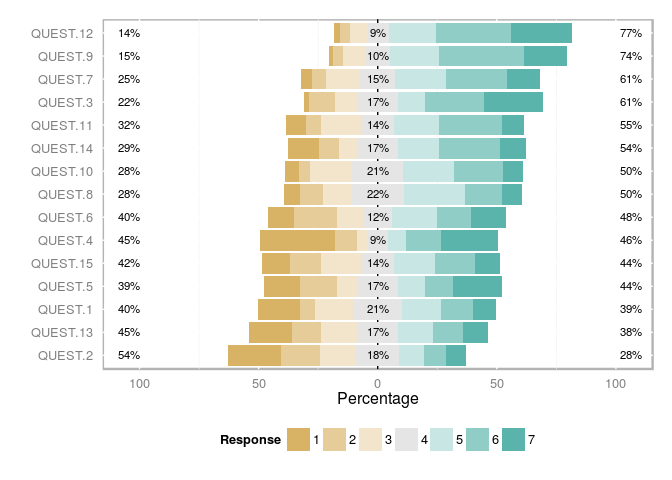 

```
   Min. 1st Qu.  Median    Mean 3rd Qu.    Max. 
   35.0    57.0    67.0    65.1    74.0    90.0 
```

```
[1] 11.9
```

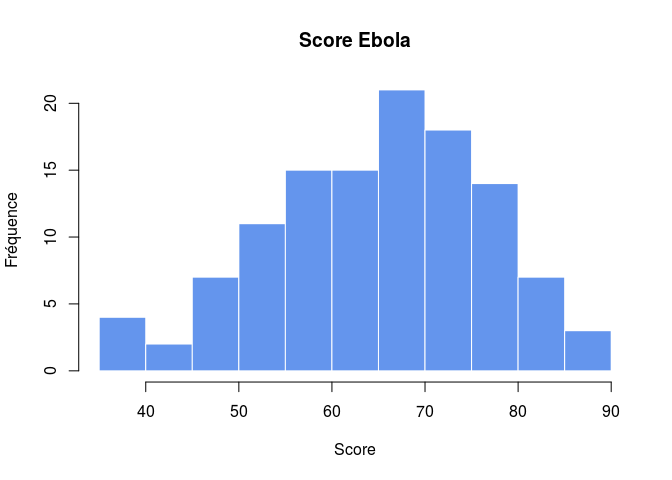 

Le score  global peut varier entre 7 et 105. 

### Comparaisons des villes


```

	Welch Two Sample t-test

data:  d$score.tot by d$VILLE
t = -2, df = 100, p-value = 0.1
alternative hypothesis: true difference in means is not equal to 0
95 percent confidence interval:
 -7.87  0.80
sample estimates:
mean in group REIMS mean in group STRAS 
               63.4                66.9 
```

Le score total moyen n'est pas différent entre Reims et Strasbourg (p = 0.11)

### comparaison des CSP

```
 ADE IADE  IDE  MED 
67.7 69.2 63.3 63.2 
```

Le score total moyen n'est pas différent entre les professions (p = 0.18)

### Score total et formation

La catégorie IDE est celle qui comporte le plus de personnel non formé. Le score total est-il différent entre le groupe personnels formées et non formées ?


```r
t <- t.test(d$score.tot ~ d$FORME)
t
```

```
## 
## 	Welch Two Sample t-test
## 
## data:  d$score.tot by d$FORME
## t = -5, df = 40, p-value = 6e-05
## alternative hypothesis: true difference in means is not equal to 0
## 95 percent confidence interval:
##  -16.76  -6.46
## sample estimates:
## mean in group N mean in group O 
##            55.9            67.5
```

```r
b <- boxplot(d$score.tot ~ d$FORME, names = c("Personnels non formés", "Personnels formés"), ylab = "Score total", col = "palegreen", main = "Comparaison des scores totaux des personnelsformés et non formés")

text(1.5, 80, paste0("p = ", round(t$p.value, 3)))
```

 

Il ya une différence significative en ce qui concerne le score total, selon que les personnels aient eu ou non une formation. Les personnels non formés ont un score inférieur aux personnels formés.

### comparaison de l'ancienneté de la formation


```
 NON  < 6 6-12  >12 
55.9 68.2 66.1 62.1 
```

```
             Df Sum Sq Mean Sq F value  Pr(>F)    
d$DUREE       3   2830     943    7.83 8.5e-05 ***
Residuals   113  13614     120                    
---
Signif. codes:  0 '***' 0.001 '**' 0.01 '*' 0.05 '.' 0.1 ' ' 1
```

 

```
  Tukey multiple comparisons of means
    95% family-wise confidence level

Fit: aov(formula = d$score.tot ~ d$DUREE)

$`d$DUREE`
          diff    lwr   upr p adj
< 6-NON  12.29   5.59 19.00 0.000
6-12-NON 10.18  -0.59 20.96 0.071
>12-NON   6.23  -6.07 18.52 0.552
6-12-< 6 -2.11 -11.74  7.52 0.940
>12-< 6  -6.07 -17.37  5.24 0.502
>12-6-12 -3.96 -18.06 10.15 0.884
```


### Conclusions: 

- il n'y a pas de différence entre le score total de Strasbourg et de Reims (p = 0.11), ni entre les différentes CSP (p = 0.18).
- le score global est d'autant plus élevé que le personnel est formé et la formation est récente (mois de 6 mois). Il y a une différence significative entre les formés et les non formés. Dans le groupe des personnels formé, la confiance semble s'estomper avec le temps bien que cette tendance ne soit pas significative (aspect graphique).


Niveau d'information (1.2)
====================

QUEST.1: Je me tiens au courant des dernières informations de la presse télévisée concernant le virus Ebola

QUEST.2: Je me tiens au courant des dernières informations de la presse écrite concernant le virus Ebola


```
   Min. 1st Qu.  Median    Mean 3rd Qu.    Max. 
    1.0     3.0     4.0     3.9     5.0     7.0 
```

```
   Min. 1st Qu.  Median    Mean 3rd Qu.    Max. 
    1.0     2.0     3.0     3.4     5.0     7.0 
```

```
REIMS STRAS 
 3.83  3.97 
```

 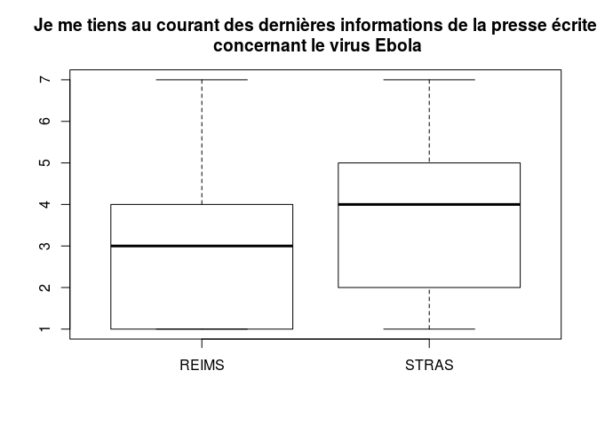 

```
     Item    1     2    3    4    5    6    7
1 QUEST.1 17.9  5.98 16.2 20.5 16.2 13.7 9.40
2 QUEST.2 22.2 16.24 15.4 17.9 10.3  9.4 8.55
```

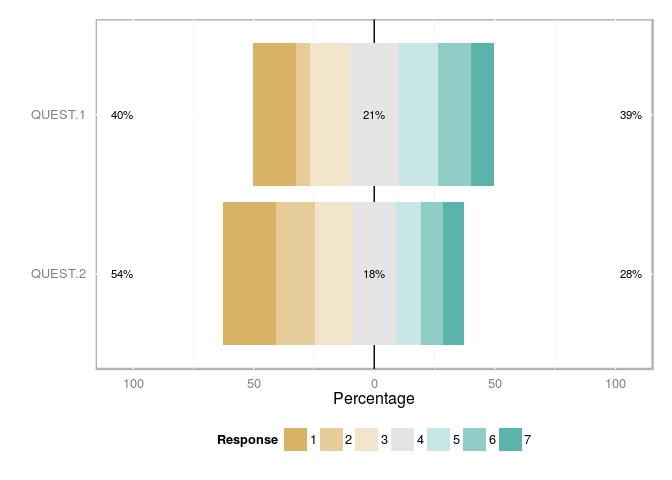 

```
   Min. 1st Qu.  Median    Mean 3rd Qu.    Max. 
    2.0     5.0     7.0     7.3     9.0    14.0 
```

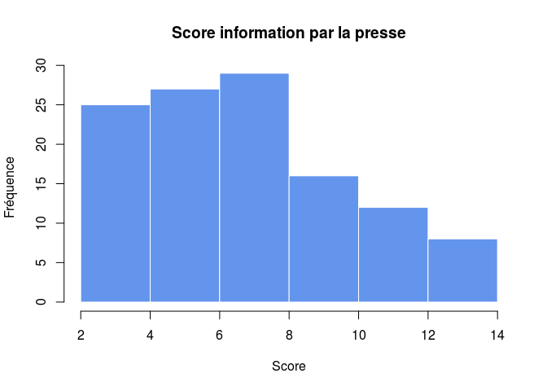 

```
      
       2 3 4 5 6 7 8 9 10 11 12 13 14
  ADE  5 0 2 2 2 1 7 4  1  1  1  0  1
  IADE 3 0 0 1 2 0 2 0  2  0  3  0  3
  IDE  2 1 5 3 8 4 7 3  3  0  3  1  1
  MED  4 0 3 1 8 2 5 0  3  3  1  1  1
```

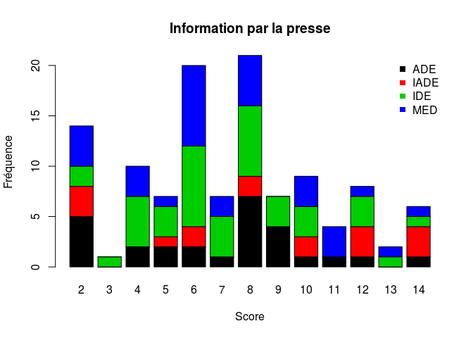 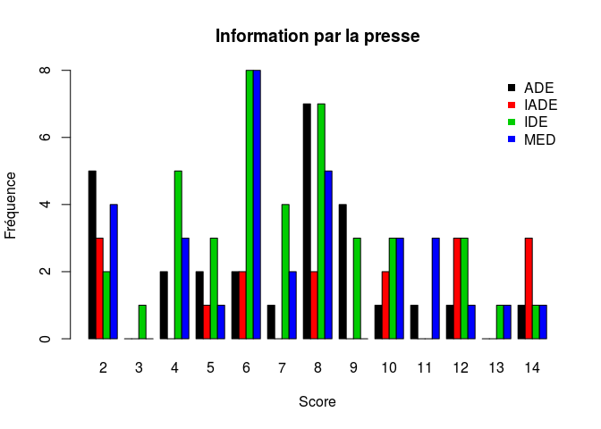 

```

	Welch Two Sample t-test

data:  d$score.presse by d$VILLE
t = -1, df = 100, p-value = 0.3
alternative hypothesis: true difference in means is not equal to 0
95 percent confidence interval:
 -1.898  0.507
sample estimates:
mean in group REIMS mean in group STRAS 
               6.95                7.64 
```

```
             Df Sum Sq Mean Sq F value Pr(>F)
VILLE         1     14    14.2    1.31   0.25
Residuals   115   1240    10.8               
```

```
             Df Sum Sq Mean Sq F value Pr(>F)
DUREE         3     48    16.1     1.5   0.22
Residuals   113   1206    10.7               
```

Niveau de formation (12.14.15)
==============================


Quel est le sentiment des personnels vis à vis de leur information/formation face à ce risque ? On étudie le score formé par les questions 12, 14 et 15, appelé __niveau de formation__.

- [12] Je pense être suffisamment informé(e) quant aux modes de transmissions du virus Ebola

- [14] Je pense être suffisamment formé(e) pour m’habiller avec la tenue de protection face au virus Ebola

- [15] Je pense être suffisamment formé(e) pour ôter la tenue de protection face au virus Ebola


```
   Min. 1st Qu.  Median    Mean 3rd Qu.    Max. 
    3.0    11.0    14.0    13.8    18.0    21.0 
```

 

```
      Item     1     2     3    4    5    6    7
1 QUEST.12  2.56  4.27  6.84  9.4 19.7 31.6 25.6
2 QUEST.14 12.82  8.55  7.69 17.1 17.1 25.6 11.1
3 QUEST.15 11.97 12.82 17.09 13.7 17.1 17.1 10.3
```

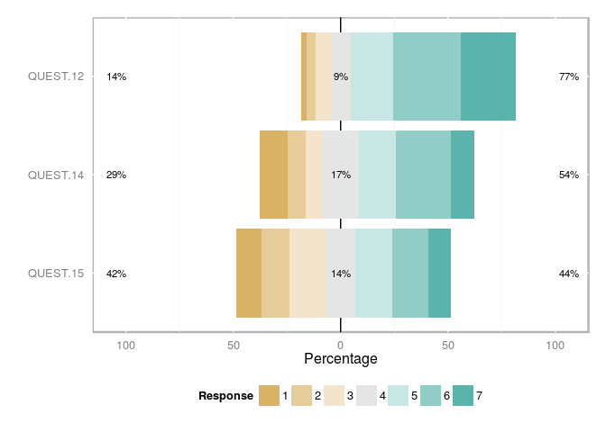 

```

	Welch Two Sample t-test

data:  d$score.formation by d$VILLE
t = 0.1, df = 100, p-value = 0.9
alternative hypothesis: true difference in means is not equal to 0
95 percent confidence interval:
 -1.60  1.84
sample estimates:
mean in group REIMS mean in group STRAS 
               13.8                13.7 
```

### comparaison des CSP

```
 ADE IADE  IDE  MED 
15.2 15.4 12.5 13.3 
```

```
             Df Sum Sq Mean Sq F value Pr(>F)  
d$CSP         3    166    55.3    2.65  0.052 .
Residuals   112   2339    20.9                 
---
Signif. codes:  0 '***' 0.001 '**' 0.01 '*' 0.05 '.' 0.1 ' ' 1
1 observation deleted due to missingness
```

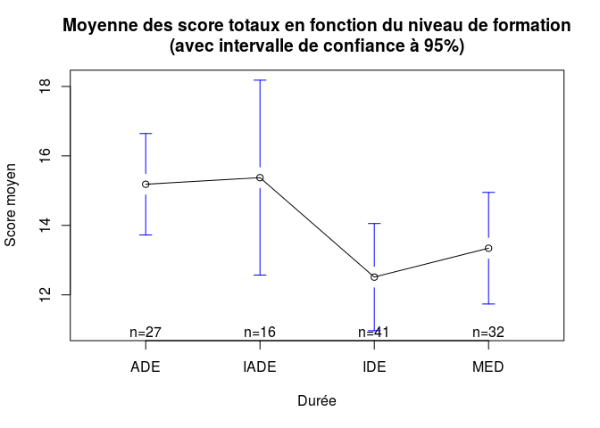 

```
  Tukey multiple comparisons of means
    95% family-wise confidence level

Fit: aov(formula = d$score.formation ~ d$CSP)

$`d$CSP`
           diff   lwr   upr p adj
IADE-ADE  0.190 -3.57 3.950 0.999
IDE-ADE  -2.673 -5.63 0.281 0.091
MED-ADE  -1.841 -4.96 1.273 0.416
IDE-IADE -2.863 -6.38 0.651 0.151
MED-IADE -2.031 -5.68 1.618 0.470
MED-IDE   0.832 -1.98 3.643 0.867
```

### Selon la formation au risque Ebola

Quel est le sentiment des personnels vis à vis de leur information/formation face à ce risque ? On étudie le score formé par les questions 12, 14 et 15, appelé niveau de formation.


```r
t <- t.test(d$FORMATION ~ d$FORME)
t
```

```
## 
## 	Welch Two Sample t-test
## 
## data:  d$FORMATION by d$FORME
## t = -8, df = 30, p-value = 1e-09
## alternative hypothesis: true difference in means is not equal to 0
## 95 percent confidence interval:
##  -9.12 -5.54
## sample estimates:
## mean in group N mean in group O 
##            7.96           15.29
```

```r
boxplot(d$FORMATION ~ d$FORME, names = c("Personnels non formés", "Personnels formés"), ylab = "Score formation", col = "palegreen", main = "sentiment des IDE vis à vis de leur information/formation")
```

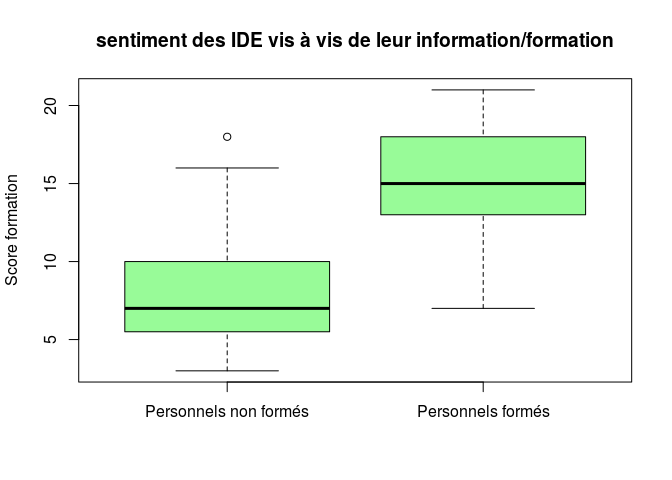 

Différence fortement significative (p = 0).


### comparaison des durées

```
  NON   < 6  6-12   >12 
 7.96 15.49 14.20 14.71 
```

```
             Df Sum Sq Mean Sq F value  Pr(>F)    
d$DUREE       3   2830     943    7.83 8.5e-05 ***
Residuals   113  13614     120                    
---
Signif. codes:  0 '***' 0.001 '**' 0.01 '*' 0.05 '.' 0.1 ' ' 1
```

 

```
  Tukey multiple comparisons of means
    95% family-wise confidence level

Fit: aov(formula = d$score.tot ~ d$DUREE)

$`d$DUREE`
          diff    lwr   upr p adj
< 6-NON  12.29   5.59 19.00 0.000
6-12-NON 10.18  -0.59 20.96 0.071
>12-NON   6.23  -6.07 18.52 0.552
6-12-< 6 -2.11 -11.74  7.52 0.940
>12-< 6  -6.07 -17.37  5.24 0.502
>12-6-12 -3.96 -18.06 10.15 0.884
```

Sentiment d'inquiétude provoqué par ebola
============================
questions 3.4.5.13 traitent du sentiment d'inquiétude provoqué par ebola

3. Le virus Ebola est une chose qui me préoccupe sur le plan professionnel
4. Si j’avais le choix, je refuserais de prendre en charge un patient suspecté d’être contaminé par le virus Ebola
5. Le virus Ebola est une chose qui me préoccupe sur le plan personnel et par rapport à mes proches
13. J’ai très peur à l’idée de devoir prendre en charge un patient suspecté d’être contaminé par le virus Ebola


```
   Min. 1st Qu.  Median    Mean 3rd Qu.    Max. 
    4.0    13.0    16.0    16.8    21.0    28.0 
```

 

```
      Item     1    2     3     4     5    6    7
1  QUEST.3  1.71 11.1  9.40 17.09 11.11 24.8 24.8
2  QUEST.4 31.62  9.4  4.27  8.55  7.69 14.5 23.9
3  QUEST.5 15.38 15.4  8.55 17.09 11.11 12.0 20.5
4 QUEST.13 17.95 12.0 15.38 17.09 14.53 12.8 10.3
```

 

Les 61% des personnels se sentent concernés par la problématique Ebola (question 3). Sur les autre items de ce sous-groupes, les inquiets et les non inquiets se partagent de manière assez équivalente.

### Comparaisons des villes

```

	Welch Two Sample t-test

data:  d$score.sent by d$VILLE
t = -2, df = 100, p-value = 0.09
alternative hypothesis: true difference in means is not equal to 0
95 percent confidence interval:
 -3.899  0.267
sample estimates:
mean in group REIMS mean in group STRAS 
               15.9                17.7 
```

L'inquiétude semble légèrement plus importante à Reims, mais la différence entre les deux villes n'est pas significative (p = 0.0869).

### comparaison des CSP

```
 ADE IADE  IDE  MED 
18.2 15.5 16.9 16.2 
```

```
             Df Sum Sq Mean Sq F value Pr(>F)
d$CSP         3     95    31.7    0.96   0.42
Residuals   112   3711    33.1               
1 observation deleted due to missingness
```

Aucune différence entre les CSP (p = 0.416).

### comparaison de l'ancienneté de la formation:

On considère 4 groupes:

- pas formation (NON)
- moins de 6 mois
- 6 à 12 mois
- plus de 12 mois


```
 NON  < 6 6-12  >12 
18.3 16.6 16.6 13.6 
```

```
             Df Sum Sq Mean Sq F value  Pr(>F)    
d$DUREE       3   2830     943    7.83 8.5e-05 ***
Residuals   113  13614     120                    
---
Signif. codes:  0 '***' 0.001 '**' 0.01 '*' 0.05 '.' 0.1 ' ' 1
```

 

```
  Tukey multiple comparisons of means
    95% family-wise confidence level

Fit: aov(formula = d$score.tot ~ d$DUREE)

$`d$DUREE`
          diff    lwr   upr p adj
< 6-NON  12.29   5.59 19.00 0.000
6-12-NON 10.18  -0.59 20.96 0.071
>12-NON   6.23  -6.07 18.52 0.552
6-12-< 6 -2.11 -11.74  7.52 0.940
>12-< 6  -6.07 -17.37  5.24 0.502
>12-6-12 -3.96 -18.06 10.15 0.884
```

Le niveau d'inquiétude n'est pas le même entre les groupes (p = 0.00008). L'inquiétude est la plus élevée dans le groupe des personnes non formées et le score d'inquiétude est statistiquement plus élevé que celui des personnes formées depuis moins de 6 mois (p = 0.0000308)

estime de soi
=============
questions 6.7.8.9.10.11 traitent de l'estime de soi

6. J’ai peur de ne pas être à la hauteur si je dois prendre en charge un patient suspecté d’être contaminé par le virus Ebola
7. Je me sens confiant(e) quant à mes capacités à collaborer avec les autres professionnels de santé lors de la prise en charge d’un patient suspecté d’être contaminé par le virus Ebola
8. Je me sens confiant(e) quant à mes capacités à prendre en charge un patient suspecté d’être contaminé par le virus Ebola
9. Je suis sûr(e) de pouvoir garder mon calme lors de la prise en charge d’un patient suspecté d’être contaminé par le virus Ebola
10. Je me sens confiant(e) quant à mes capacités à assurer les soins nécessaires lors de la prise en charge d’un patient suspecté d’être contaminé par le virus Ebola
11. Je me sens confiant(e) quant à mes capacités à pouvoir me protéger lors de la prise en charge d’un patient suspecté d’être contaminé par le virus Ebola


```
   Min. 1st Qu.  Median    Mean 3rd Qu.    Max. 
    9.0    22.0    27.0    27.1    33.0    41.0 
```

 

```
      Item     1     2    3    4    5    6     7
1  QUEST.6 14.53 14.53 18.8 12.0 11.1 17.9 11.11
2  QUEST.7  4.27  5.98 14.5 14.5 21.4 25.6 13.68
3  QUEST.8  6.84  9.40 12.0 22.2 25.6 15.4  8.55
4  QUEST.9  1.71  4.27  9.4 10.3 20.5 35.9 17.95
5 QUEST.10  5.98  4.27 17.9 21.4 21.4 20.5  8.55
6 QUEST.11  8.55  5.98 17.1 13.7 18.8 26.5  9.40
```

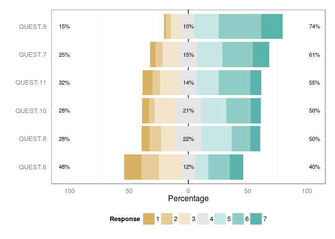 

```

	Welch Two Sample t-test

data:  d$score.estime by d$VILLE
t = 1, df = 100, p-value = 0.3
alternative hypothesis: true difference in means is not equal to 0
95 percent confidence interval:
 -1.39  3.95
sample estimates:
mean in group REIMS mean in group STRAS 
               27.7                26.4 
```
Globalement les personnes interrogées ont une bonne estime d'eux concernant leur professionalisme concernant la prise en charge de ce type de patient (question 9, 74% d'opinion favorable) et leur capacité à travailler avec d'autres professionnels de santé (question 7, 61% d'opinion favorable). Les opinions sont plus mesurées concernant la capacité à assurer des soins (q10) et à se protéger (q11) avec 55% et 50% d'opinion favorable. Cet optimisme prudent peut s'expliquer à l'absence de confrontation avec des cas réels. La question 6 avec moins de 50% d'opinion favorables tempère l'optimisme des question 9 et 7. En résumé une attitude plutôt raisonnable, sans triomphalisme ni d'inquiétute excessifs.

Ce sentiment est partagé par les professionnels des deux villes (pas de différence, p = 0.29  )

### comparaison des CSP

```
 ADE IADE  IDE  MED 
26.9 31.5 26.3 26.0 
```

```
             Df Sum Sq Mean Sq F value Pr(>F)  
d$CSP         3    378   126.1    2.45  0.067 .
Residuals   112   5761    51.4                 
---
Signif. codes:  0 '***' 0.001 '**' 0.01 '*' 0.05 '.' 0.1 ' ' 1
1 observation deleted due to missingness
```

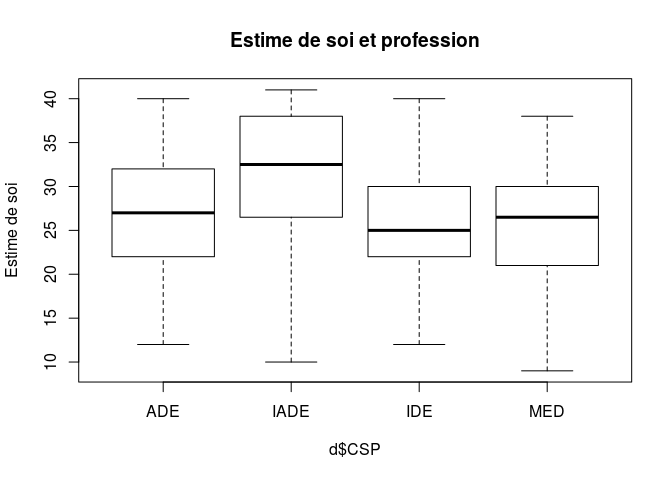 

```
  Tukey multiple comparisons of means
    95% family-wise confidence level

Fit: aov(formula = d$score.estime ~ d$CSP)

$`d$CSP`
           diff    lwr    upr p adj
IADE-ADE  4.648  -1.25 10.550 0.175
IDE-ADE  -0.584  -5.22  4.053 0.988
MED-ADE  -0.852  -5.74  4.036 0.969
IDE-IADE -5.232 -10.75  0.282 0.070
MED-IADE -5.500 -11.23  0.227 0.065
MED-IDE  -0.268  -4.68  4.144 0.999
```

Les IADE ont le score d'esime de soi le plus élevé. Il n'y a pas de différence significative entre les CSP on est très proche d'une différence significative (p = 0.067). 

### Estime de soi et formation


```r
t <- t.test(d$ESTIME ~ d$FORME)
t
```

```
## 
## 	Welch Two Sample t-test
## 
## data:  d$ESTIME by d$FORME
## t = -4, df = 40, p-value = 1e-04
## alternative hypothesis: true difference in means is not equal to 0
## 95 percent confidence interval:
##  -9.79 -3.47
## sample estimates:
## mean in group N mean in group O 
##            21.8            28.4
```

```r
boxplot(d$ESTIME ~ d$FORME, names = c("Non formés", "Formés"), ylab = "Estime de soi", main = "Estime de soi et formation à la prise en charge d'un cas d'Ebola")
abline(h = mean(d$ESTIME), lty = 2, col = "red")
legend("topleft", legend = "Score moyen", lty = 2, col = "red", bty = "n")
```

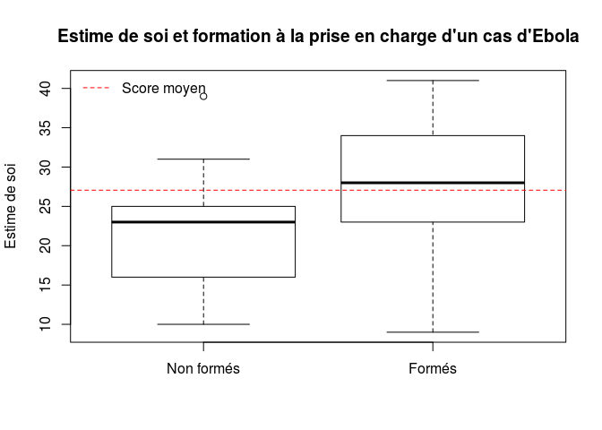 
Il y a une différence fortement significative (p = 0) entre les groupes. Les personnes formées ont un sentiment d'estime de soi supérieur à celui des personnes non formées.

### comparaison des durées

```
 NON  < 6 6-12  >12 
21.8 28.5 26.5 30.1 
```

```
             Df Sum Sq Mean Sq F value  Pr(>F)    
d$DUREE       3    896   298.8    6.44 0.00046 ***
Residuals   113   5244    46.4                    
---
Signif. codes:  0 '***' 0.001 '**' 0.01 '*' 0.05 '.' 0.1 ' ' 1
```

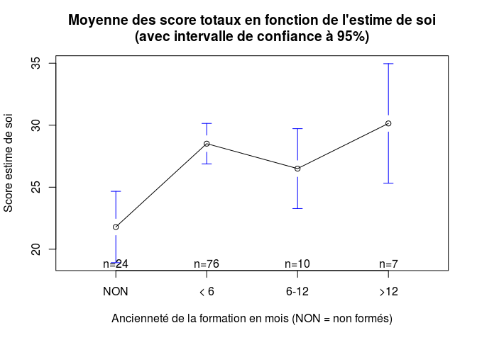 

```
  Tukey multiple comparisons of means
    95% family-wise confidence level

Fit: aov(formula = d$score.estime ~ d$DUREE)

$`d$DUREE`
          diff   lwr   upr p adj
< 6-NON   6.72  2.56 10.88 0.000
6-12-NON  4.71 -1.98 11.39 0.262
>12-NON   8.35  0.72 15.98 0.026
6-12-< 6 -2.01 -7.99  3.96 0.816
>12-< 6   1.63 -5.39  8.65 0.930
>12-6-12  3.64 -5.11 12.40 0.699
```

Le fait d'être formé ou pas influence l'estime de soi. Les personnels non formés ont le score de confiance les plus bas (23,07) et ce score est statistiquement différent du score des personnels formés depuis moins de 6 mois (p = 0.00033). La comparaison avec les personnes formées il a plus de 6 mis ou de 12 mois est de peu de valeur compte tenu de la faiblesse des effectifs.

Si on forme 3 groupes en regrouppant les personnes formées depuis 6 mois ou plus:

- pas de formation (NON)
- moins de 6 mois
- plus de 6 mois

la différence est plus nette:

```
##  < 6  > 6  NON 
## 28.5 28.0 21.8
```

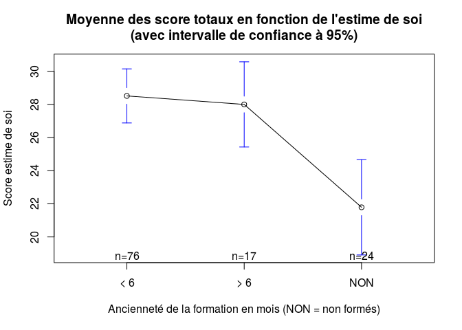 

```
##              Df Sum Sq Mean Sq F value  Pr(>F)    
## d$DUREE       3    896   298.8    6.44 0.00046 ***
## Residuals   113   5244    46.4                    
## ---
## Signif. codes:  0 '***' 0.001 '**' 0.01 '*' 0.05 '.' 0.1 ' ' 1
```

```
##   Tukey multiple comparisons of means
##     95% family-wise confidence level
## 
## Fit: aov(formula = d$score.estime ~ d$DUREE)
## 
## $`d$DUREE`
##           diff   lwr   upr p adj
## < 6-NON   6.72  2.56 10.88 0.000
## 6-12-NON  4.71 -1.98 11.39 0.262
## >12-NON   8.35  0.72 15.98 0.026
## 6-12-< 6 -2.01 -7.99  3.96 0.816
## >12-< 6   1.63 -5.39  8.65 0.930
## >12-6-12  3.64 -5.11 12.40 0.699
```
Au moins un des score est différent des autres (p = 0.0007). Le test de Tukey révèle que le score d'estime de soi des personnes non formées est statistiquement plus faible que celui des personnes formées, que ce soit à 6 mois (p = 0.00001) ou plus de 6 mois (p = 0.04). Par contre il n'y a pas de différence entre les score des personnels formés à 6mois et plus de 6 mois (p = 0.41).
