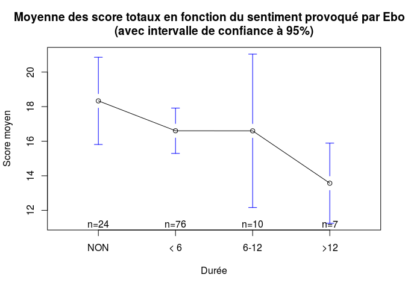

# Questionnaire EBOLA
JcB, SUffler  
21 juin 2015  

QR: Evaluation de l'anxiété face à la menace Ebola, au sein du personnel des urgences. Etude multicentrique portant sur deux villes universitaires (Reims et Strasbourg).

Au cours des tests statistiques, une différence est considérée comme significative lorsque __p < 0.05__ (5%). Les tests statistiques utilisés:

- Test t de Student pour comparer 2 variables quantitatives
- Analyse de la variance (ANOVA) pour comparer 3 variables quantitatives ou plus
- Le test du Chi2 pour comparer 2 variables qualitatives ou le test exact de Fisher lorsque les effectifs sont faibles.
- Une différence entre deux ou plusieurs groupes est considérée commme significative lorsque p < 0.05 (5%) [c'est à dire qu'il y a moins de 5 chances sur 100 que la différence observée soit due au hasard]

Le questionnaire comprend 2 parties:

- des questions factorielles (Ville, catégorie socio-profesionnelle [CSP]) qui permettent de créer des sous groupes.
- 15 questions sous forme d'items de Lickert (7 niveaux de réponses) constituant une échelle de Likert. Pour chaque item, la réponse 
est une variable ordinale (c'est à dire que le rang est significatif) variant de 1 à 7. Le choix de la réponse possible est un nombre impair ce qui implicetement découpe l'éventail des réponses possibles en trois zones:
    - zone de rejet (1 à 3)
    - zone d'indécision (4)
    - zone d'acceptation (5 à 7)
    
Les questions peuvent être regroupées pour former des scores intermédiaires:

    - niveau d'information (1 et 2)
    - niveau de formation (12.14.15)
    - sentiment provoqué par ebola (3.4.5.13)
    - estime de soi (6.7.8.9.10.11)

Données générales
===================


```
     NUMERO       QUEST.1         QUEST.2         QUEST.3     
 Min.   :  1   Min.   :1.000   Min.   :1.000   Min.   :1.000  
 1st Qu.: 30   1st Qu.:3.000   1st Qu.:2.000   1st Qu.:4.000  
 Median : 59   Median :4.000   Median :3.000   Median :5.000  
 Mean   : 59   Mean   :3.897   Mean   :3.402   Mean   :4.983  
 3rd Qu.: 88   3rd Qu.:5.000   3rd Qu.:5.000   3rd Qu.:6.000  
 Max.   :117   Max.   :7.000   Max.   :7.000   Max.   :7.000  
    QUEST.4         QUEST.5         QUEST.6         QUEST.7     
 Min.   :1.000   Min.   :1.000   Min.   :1.000   Min.   :1.000  
 1st Qu.:1.000   1st Qu.:2.000   1st Qu.:2.000   1st Qu.:4.000  
 Median :4.000   Median :4.000   Median :4.000   Median :5.000  
 Mean   :3.906   Mean   :4.111   Mean   :4.111   Mean   :4.744  
 3rd Qu.:6.000   3rd Qu.:6.000   3rd Qu.:6.000   3rd Qu.:6.000  
 Max.   :7.000   Max.   :7.000   Max.   :7.000   Max.   :7.000  
    QUEST.8         QUEST.9         QUEST.10        QUEST.11    
 Min.   :1.000   Min.   :1.000   Min.   :1.000   Min.   :1.000  
 1st Qu.:3.000   1st Qu.:4.000   1st Qu.:3.000   1st Qu.:3.000  
 Median :4.000   Median :6.000   Median :5.000   Median :5.000  
 Mean   :4.308   Mean   :5.231   Mean   :4.436   Mean   :4.453  
 3rd Qu.:5.000   3rd Qu.:6.000   3rd Qu.:6.000   3rd Qu.:6.000  
 Max.   :7.000   Max.   :7.000   Max.   :7.000   Max.   :7.000  
    QUEST.12        QUEST.13        QUEST.14        QUEST.15     FORME 
 Min.   :1.000   Min.   :1.000   Min.   :1.000   Min.   :1.000   N:24  
 1st Qu.:5.000   1st Qu.:2.000   1st Qu.:3.000   1st Qu.:3.000   O:93  
 Median :6.000   Median :4.000   Median :5.000   Median :4.000         
 Mean   :5.368   Mean   :3.778   Mean   :4.385   Mean   :4.034         
 3rd Qu.:7.000   3rd Qu.:5.000   3rd Qu.:6.000   3rd Qu.:6.000         
 Max.   :7.000   Max.   :7.000   Max.   :7.000   Max.   :7.000         
  DUREE    SAMU      CSP       VILLE   
 NON :24     :24   ADE :27   REIMS:58  
 < 6 :76   O :85   IADE:16   STRAS:59  
 6-12:10   O+: 8   IDE :41             
 >12 : 7           MED :32             
                   NA's: 1             
                                       
```
Le fichier des données comporte 117 lignes et 21 variables:

```
 [1] "NUMERO"   "QUEST.1"  "QUEST.2"  "QUEST.3"  "QUEST.4"  "QUEST.5" 
 [7] "QUEST.6"  "QUEST.7"  "QUEST.8"  "QUEST.9"  "QUEST.10" "QUEST.11"
[13] "QUEST.12" "QUEST.13" "QUEST.14" "QUEST.15" "FORME"    "DUREE"   
[19] "SAMU"     "CSP"      "VILLE"   
```

Le __coefficient de Cronbach__ pour la partie score de Likert est de __0.68__ ([interprétation du coefficient de Cronbach](http://www.wikiwand.com/en/Cronbach's_alpha)).

Les colonnes 2 à 16 correspondent aux items de Likert et 17 à 21 sont des variables factorielles sauf "DUREE".

Répartition des participants:


```
       
        ADE IADE IDE MED
  REIMS  11    9  26  12
  STRAS  16    7  15  20
```
Il n'y a pas de différence significative dans la composition des deux échantillons (chi2 = 6.13, p = 0.11).


Analyse univariée
=================

Catégorie socio-professionnelle
-------------------------------


```
 ADE IADE  IDE  MED NA's 
  27   16   41   32    1 
```

Ville
-----

```
REIMS STRAS 
   58    59 
```

```
       
        ADE IADE IDE MED
  REIMS  11    9  26  12
  STRAS  16    7  15  20
```

```

	Pearson's Chi-squared test

data:  d$VILLE and d$CSP
X-squared = 6.1271, df = 3, p-value = 0.1056
```

Durée de la formation
---------------------

```
 NON  < 6 6-12  >12 
  24   76   10    7 
```

```
       
        NON < 6 6-12 >12
  REIMS  19  33    0   6
  STRAS   5  43   10   1
```

```
Warning in chisq.test(d$VILLE, d$DUREE): Chi-squared approximation may be
incorrect
```

```

	Pearson's Chi-squared test

data:  d$VILLE and d$DUREE
X-squared = 23.047, df = 3, p-value = 3.948e-05
```

```

	Pearson's Chi-squared test

data:  t3
X-squared = 10.945, df = 2, p-value = 0.0042
```

```
       
        NON < 6 6-12 >12
  REIMS  19  33    0   6
  STRAS   5  43   10   1
```

```

	Fisher's Exact Test for Count Data

data:  d$VILLE and d$DUREE
p-value = 7.586e-06
alternative hypothesis: two.sided
```
Il existe une différence significative entre Strasbourg et Reims pour la variable durée.

Likert
======

Score global (somme des 15 items de Likert)
-------------------------------------------
Le score global peut être interprété comme le degré de confiance d'un personnel hospitalier pour la prise en charge d'un patient suspect f'Ebola.


```
   Min. 1st Qu.  Median    Mean 3rd Qu.    Max. 
  35.00   57.00   67.00   65.15   74.00   90.00 
```

```
[1] 11.90643
```

 

Le score  global peut varier entre 7 et 105.

### Comparaisons des villes


```

	Welch Two Sample t-test

data:  d$score.tot by d$VILLE
t = -1.6158, df = 113.1, p-value = 0.1089
alternative hypothesis: true difference in means is not equal to 0
95 percent confidence interval:
 -7.8720530  0.7995807
sample estimates:
mean in group REIMS mean in group STRAS 
           63.36207            66.89831 
```

### comparaison des CSP

```
     ADE     IADE      IDE      MED 
67.74074 69.18750 63.26829 63.21875 
```

### comparaison des durées

```
     NON      < 6     6-12      >12 
55.91667 68.21053 66.10000 62.14286 
```

```
             Df Sum Sq Mean Sq F value   Pr(>F)    
d$DUREE       3   2830   943.4   7.831 8.55e-05 ***
Residuals   113  13614   120.5                     
---
Signif. codes:  0 '***' 0.001 '**' 0.01 '*' 0.05 '.' 0.1 ' ' 1
```

 

```
  Tukey multiple comparisons of means
    95% family-wise confidence level

Fit: aov(formula = d$score.tot ~ d$DUREE)

$`d$DUREE`
              diff         lwr       upr     p adj
< 6-NON  12.293860   5.5919550 18.995764 0.0000308
6-12-NON 10.183333  -0.5898612 20.956528 0.0710846
>12-NON   6.226190  -6.0690456 18.521427 0.5518801
6-12-< 6 -2.110526 -11.7389035  7.517851 0.9403476
>12-< 6  -6.067669 -17.3732764  5.237938 0.5022800
>12-6-12 -3.957143 -18.0625656 10.148280 0.8842280
```


### Conclusions: 

- il n'y a pas de différence entre le score total de Strasbourg et de Reims (p = 0.11), ni entre les différentes CSP (p = 0.18).
- le score global est d'autant plus élevé que le personnel est formé et la formation est récente (mois de 6 mois). Il y a une différence significative entre les formés et les non formés. Dans le groupe des personnels formé, la confiance semble s'estomper avec le temps bien que cette tendance ne soit pas significative (aspect graphique).


Niveau d'information (1.2)
====================

QUEST.1: Je me tiens au courant des dernières informations de la presse télévisée concernant le virus Ebola

QUEST.2: Je me tiens au courant des dernières informations de la presse écrite concernant le virus Ebola


```
   Min. 1st Qu.  Median    Mean 3rd Qu.    Max. 
  1.000   3.000   4.000   3.897   5.000   7.000 
```

```
   Min. 1st Qu.  Median    Mean 3rd Qu.    Max. 
  1.000   2.000   3.000   3.402   5.000   7.000 
```

```
   REIMS    STRAS 
3.827586 3.966102 
```

  

```
     Item        1         2        3        4        5         6        7
1 QUEST.1 17.94872  5.982906 16.23932 20.51282 16.23932 13.675214 9.401709
2 QUEST.2 22.22222 16.239316 15.38462 17.94872 10.25641  9.401709 8.547009
```

 

```
   Min. 1st Qu.  Median    Mean 3rd Qu.    Max. 
  2.000   5.000   7.000   7.299   9.000  14.000 
```

 

```
      
       2 3 4 5 6 7 8 9 10 11 12 13 14
  ADE  5 0 2 2 2 1 7 4  1  1  1  0  1
  IADE 3 0 0 1 2 0 2 0  2  0  3  0  3
  IDE  2 1 5 3 8 4 7 3  3  0  3  1  1
  MED  4 0 3 1 8 2 5 0  3  3  1  1  1
```

  

```

	Welch Two Sample t-test

data:  d$score.presse by d$VILLE
t = -1.1461, df = 114.96, p-value = 0.2541
alternative hypothesis: true difference in means is not equal to 0
95 percent confidence interval:
 -1.8983081  0.5067243
sample estimates:
mean in group REIMS mean in group STRAS 
           6.948276            7.644068 
```

```
             Df Sum Sq Mean Sq F value Pr(>F)
VILLE         1   14.2   14.16   1.313  0.254
Residuals   115 1240.4   10.79               
```

```
             Df Sum Sq Mean Sq F value Pr(>F)
DUREE         3   48.2   16.05   1.504  0.217
Residuals   113 1206.4   10.68               
```

Niveau de formation (12.14.15)
==============================

12. Je pense être suffisamment informé(e) quant aux modes de transmissions du virus Ebola

14. Je pense être suffisamment formé(e) pour m’habiller avec la tenue de protection face au virus Ebola

15. Je pense être suffisamment formé(e) pour ôter la tenue de protection face au virus Ebola


```
   Min. 1st Qu.  Median    Mean 3rd Qu.    Max. 
   3.00   11.00   14.00   13.79   18.00   21.00 
```

 

```
      Item         1         2         3         4        5        6
1 QUEST.12  2.564103  4.273504  6.837607  9.401709 19.65812 31.62393
2 QUEST.14 12.820513  8.547009  7.692308 17.094017 17.09402 25.64103
3 QUEST.15 11.965812 12.820513 17.094017 13.675214 17.09402 17.09402
         7
1 25.64103
2 11.11111
3 10.25641
```

 

```

	Welch Two Sample t-test

data:  d$score.formation by d$VILLE
t = 0.1338, df = 103.83, p-value = 0.8938
alternative hypothesis: true difference in means is not equal to 0
95 percent confidence interval:
 -1.603485  1.835513
sample estimates:
mean in group REIMS mean in group STRAS 
           13.84483            13.72881 
```

### comparaison des CSP

```
     ADE     IADE      IDE      MED 
15.18519 15.37500 12.51220 13.34375 
```

```
             Df Sum Sq Mean Sq F value Pr(>F)  
d$CSP         3    166   55.32   2.649 0.0524 .
Residuals   112   2339   20.89                 
---
Signif. codes:  0 '***' 0.001 '**' 0.01 '*' 0.05 '.' 0.1 ' ' 1
1 observation deleted due to missingness
```

 

```
  Tukey multiple comparisons of means
    95% family-wise confidence level

Fit: aov(formula = d$score.formation ~ d$CSP)

$`d$CSP`
               diff       lwr       upr     p adj
IADE-ADE  0.1898148 -3.570608 3.9502373 0.9991806
IDE-ADE  -2.6729901 -5.627088 0.2811082 0.0909832
MED-ADE  -1.8414352 -4.956115 1.2732447 0.4161676
IDE-IADE -2.8628049 -6.376223 0.6506129 0.1514920
MED-IADE -2.0312500 -5.680721 1.6182210 0.4701986
MED-IDE   0.8315549 -1.979950 3.6430595 0.8672126
```

### comparaison des durées

```
      NON       < 6      6-12       >12 
 7.958333 15.486842 14.200000 14.714286 
```

```
             Df Sum Sq Mean Sq F value   Pr(>F)    
d$DUREE       3   2830   943.4   7.831 8.55e-05 ***
Residuals   113  13614   120.5                     
---
Signif. codes:  0 '***' 0.001 '**' 0.01 '*' 0.05 '.' 0.1 ' ' 1
```

 

```
  Tukey multiple comparisons of means
    95% family-wise confidence level

Fit: aov(formula = d$score.tot ~ d$DUREE)

$`d$DUREE`
              diff         lwr       upr     p adj
< 6-NON  12.293860   5.5919550 18.995764 0.0000308
6-12-NON 10.183333  -0.5898612 20.956528 0.0710846
>12-NON   6.226190  -6.0690456 18.521427 0.5518801
6-12-< 6 -2.110526 -11.7389035  7.517851 0.9403476
>12-< 6  -6.067669 -17.3732764  5.237938 0.5022800
>12-6-12 -3.957143 -18.0625656 10.148280 0.8842280
```

Sentiment d'inquiétude provoqué par ebola
============================
questions 3.4.5.13 traitent du sentiment d'inquiétude provoqué par ebola

3. Le virus Ebola est une chose qui me préoccupe sur le plan professionnel
4. Si j’avais le choix, je refuserais de prendre en charge un patient suspecté d’être contaminé par le virus Ebola
5. Le virus Ebola est une chose qui me préoccupe sur le plan personnel et par rapport à mes proches
13. J’ai très peur à l’idée de devoir prendre en charge un patient suspecté d’être contaminé par le virus Ebola


```
   Min. 1st Qu.  Median    Mean 3rd Qu.    Max. 
   4.00   13.00   16.00   16.78   21.00   28.00 
```

 

```
      Item         1         2         3         4         5        6
1  QUEST.3  1.709402 11.111111  9.401709 17.094017 11.111111 24.78632
2  QUEST.4 31.623932  9.401709  4.273504  8.547009  7.692308 14.52991
3  QUEST.5 15.384615 15.384615  8.547009 17.094017 11.111111 11.96581
4 QUEST.13 17.948718 11.965812 15.384615 17.094017 14.529915 12.82051
         7
1 24.78632
2 23.93162
3 20.51282
4 10.25641
```

 

Les 61% des personnels se sentent concernés par la problématique Ebola (question 3). Sur les autre items de ce sous-groupes, les inquiets et les non inquiets se partagent de manière assez équivalente.

### Comparaisons des villes

```

	Welch Two Sample t-test

data:  d$score.sent by d$VILLE
t = -1.7268, df = 114.74, p-value = 0.0869
alternative hypothesis: true difference in means is not equal to 0
95 percent confidence interval:
 -3.8990039  0.2672096
sample estimates:
mean in group REIMS mean in group STRAS 
           15.86207            17.67797 
```

L'inquiétude semble légèrement plus importante à Reims, mais la différence entre les deux villes n'est pas significative (p = 0.0869).

### comparaison des CSP

```
     ADE     IADE      IDE      MED 
18.22222 15.50000 16.87805 16.15625 
```

```
             Df Sum Sq Mean Sq F value Pr(>F)
d$CSP         3     95   31.72   0.957  0.416
Residuals   112   3711   33.14               
1 observation deleted due to missingness
```

Aucune différence entre les CSP (p = 0.416).

### comparaison de l'ancienneté de la formation:

On considère 4 groupes:

- pas formation (NON)
- moins de 6 mois
- 6 à 12 mois
- plus de 12 mois


```
     NON      < 6     6-12      >12 
18.33333 16.60526 16.60000 13.57143 
```

```
             Df Sum Sq Mean Sq F value   Pr(>F)    
d$DUREE       3   2830   943.4   7.831 8.55e-05 ***
Residuals   113  13614   120.5                     
---
Signif. codes:  0 '***' 0.001 '**' 0.01 '*' 0.05 '.' 0.1 ' ' 1
```

 

```
  Tukey multiple comparisons of means
    95% family-wise confidence level

Fit: aov(formula = d$score.tot ~ d$DUREE)

$`d$DUREE`
              diff         lwr       upr     p adj
< 6-NON  12.293860   5.5919550 18.995764 0.0000308
6-12-NON 10.183333  -0.5898612 20.956528 0.0710846
>12-NON   6.226190  -6.0690456 18.521427 0.5518801
6-12-< 6 -2.110526 -11.7389035  7.517851 0.9403476
>12-< 6  -6.067669 -17.3732764  5.237938 0.5022800
>12-6-12 -3.957143 -18.0625656 10.148280 0.8842280
```

Le niveau d'inquiétude n'est pas le même entre les groupes (p = 0.00008). L'inquiétude est la plus élevée dans le groupe des personnes non formées et le score d'inquiétude est statistiquement plus élevé que celui des personnes formées depuis moins de 6 mois (p = 0.0000308)

estime de soi
=============
questions 6.7.8.9.10.11 traitent de l'estime de soi

6. J’ai peur de ne pas être à la hauteur si je dois prendre en charge un patient suspecté d’être contaminé par le virus Ebola
7. Je me sens confiant(e) quant à mes capacités à collaborer avec les autres professionnels de santé lors de la prise en charge d’un patient suspecté d’être contaminé par le virus Ebola
8. Je me sens confiant(e) quant à mes capacités à prendre en charge un patient suspecté d’être contaminé par le virus Ebola
9. Je suis sûr(e) de pouvoir garder mon calme lors de la prise en charge d’un patient suspecté d’être contaminé par le virus Ebola
10. Je me sens confiant(e) quant à mes capacités à assurer les soins nécessaires lors de la prise en charge d’un patient suspecté d’être contaminé par le virus Ebola
11. Je me sens confiant(e) quant à mes capacités à pouvoir me protéger lors de la prise en charge d’un patient suspecté d’être contaminé par le virus Ebola


```
   Min. 1st Qu.  Median    Mean 3rd Qu.    Max. 
   9.00   24.00   28.00   27.28   31.00   41.00 
```

 

```
      Item         1         2         3        4        5        6
1  QUEST.6 11.111111 17.948718 11.111111 11.96581 18.80342 14.52991
2  QUEST.7  4.273504  5.982906 14.529915 14.52991 21.36752 25.64103
3  QUEST.8  6.837607  9.401709 11.965812 22.22222 25.64103 15.38462
4  QUEST.9  1.709402  4.273504  9.401709 10.25641 20.51282 35.89744
5 QUEST.10  5.982906  4.273504 17.948718 21.36752 21.36752 20.51282
6 QUEST.11  8.547009  5.982906 17.094017 13.67521 18.80342 26.49573
          7
1 14.529915
2 13.675214
3  8.547009
4 17.948718
5  8.547009
6  9.401709
```

 

```

	Welch Two Sample t-test

data:  d$score.estime by d$VILLE
t = -1.0533, df = 113.56, p-value = 0.2945
alternative hypothesis: true difference in means is not equal to 0
95 percent confidence interval:
 -3.285827  1.004705
sample estimates:
mean in group REIMS mean in group STRAS 
           26.70690            27.84746 
```
Globalement les personnes interrogées ont une bonne estime d'eux concernant leur professionalisme concernant la prise en charge de ce type de patient (question 9, 74% d'opinion favorable) et leur capacité à travailler avec d'autres professionnels de santé (question 7, 61% d'opinion favorable). Les opinions sont plus mesurées concernant la capacité à assurer des soins (q10) et à se protéger (q11) avec 55% et 50% d'opinion favorable. Cet optimisme prudent peut s'expliquer à l'absence de confrontation avec des cas réels. La question 6 avec moins de 50% d'opinion favorables tempère l'optimisme des question 9 et 7. En résumé une attitude plutôt raisonnable, sans triomphalisme ni d'inquiétute excessifs.

Ce sentiment est partagé par les professionnels des deux villes (pas de différence, p = 0.29  )

### comparaison des CSP

```
     ADE     IADE      IDE      MED 
27.44444 29.75000 26.70732 26.56250 
```

```
             Df Sum Sq Mean Sq F value Pr(>F)
d$CSP         3    128   42.74   1.246  0.296
Residuals   112   3840   34.29               
1 observation deleted due to missingness
```

Ce sentiment est également partagé entre les difféentes catégories socio-professionnelles (pas de différence, p = 0.296)

### comparaison des durées

```
     NON      < 6     6-12      >12 
23.04167 28.43421 27.90000 28.42857 
```

```
             Df Sum Sq Mean Sq F value   Pr(>F)    
d$DUREE       3    545  181.82   5.989 0.000796 ***
Residuals   113   3430   30.36                     
---
Signif. codes:  0 '***' 0.001 '**' 0.01 '*' 0.05 '.' 0.1 ' ' 1
```

 

```
  Tukey multiple comparisons of means
    95% family-wise confidence level

Fit: aov(formula = d$score.estime ~ d$DUREE)

$`d$DUREE`
                 diff        lwr       upr     p adj
< 6-NON   5.392543860  2.0284793  8.756608 0.0003330
6-12-NON  4.858333333 -0.5493415 10.266008 0.0945454
>12-NON   5.386904762 -0.7847687 11.558578 0.1097848
6-12-< 6 -0.534210526 -5.3672369  4.298816 0.9916136
>12-< 6  -0.005639098 -5.6805620  5.669284 1.0000000
>12-6-12  0.528571429 -6.5517370  7.608880 0.9973712
```

Le fait d'être formé ou pas influence l'estime de soi. Les personnels non formés ont le score de confiance les plus bas (23,07) et ce score est statistiquement différent du score des personnels formés depuis moins de 6 mois (p = 0.00033). La comparaison avec les personnes formées il a plus de 6 mis ou de 12 mois est de peu de valeur compte tenu de la faiblesse des effectifs.

Si on forme 3 groupes en regrouppant les personnes formées depuis 6 mois ou plus:

- pas de formation (NON)
- moins de 6 mois
- plus de 6 mois

la différence est plus nette:

```
##      < 6      > 6      NON 
## 28.43421 28.11765 23.04167
```

 

```
##              Df Sum Sq Mean Sq F value   Pr(>F)    
## d$DUREE       3    545  181.82   5.989 0.000796 ***
## Residuals   113   3430   30.36                     
## ---
## Signif. codes:  0 '***' 0.001 '**' 0.01 '*' 0.05 '.' 0.1 ' ' 1
```

```
##   Tukey multiple comparisons of means
##     95% family-wise confidence level
## 
## Fit: aov(formula = d$score.estime ~ d$DUREE)
## 
## $`d$DUREE`
##                  diff        lwr       upr     p adj
## < 6-NON   5.392543860  2.0284793  8.756608 0.0003330
## 6-12-NON  4.858333333 -0.5493415 10.266008 0.0945454
## >12-NON   5.386904762 -0.7847687 11.558578 0.1097848
## 6-12-< 6 -0.534210526 -5.3672369  4.298816 0.9916136
## >12-< 6  -0.005639098 -5.6805620  5.669284 1.0000000
## >12-6-12  0.528571429 -6.5517370  7.608880 0.9973712
```
Au moins un des score est différent des autres (p = 0.0007). Le test de Tukey révèle que le score d'estime de soi des personnes non formées est statistiquement plus faible que celui des personnes formées, que ce soit à 6 mois (p = 0.00001) ou plus de 6 mois (p = 0.04). Par contre il n'y a pas de différence entre les score des personnels formés à 6mois et plus de 6 mois (p = 0.41).
